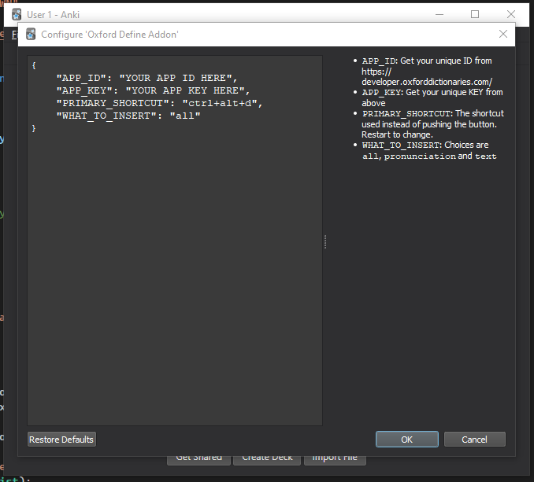
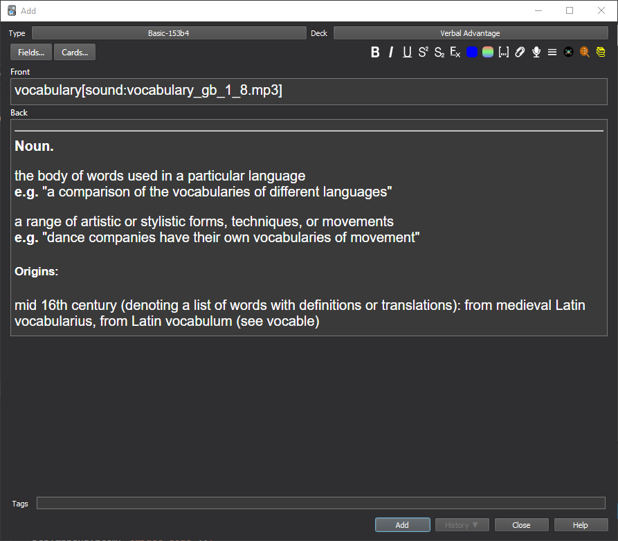

# OxfordDefine
Based on https://github.com/z1lc/AutoDefine but with the Oxford dictionary 📚

Note: this addon requires the `requests` python module.
It is planned to move towards `urllib` but for now you will need to
`pip install requests`

Don't forget to add your own Oxford API ID and key before using the addon.

## Preview
